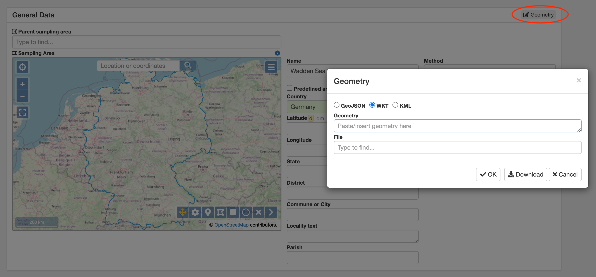
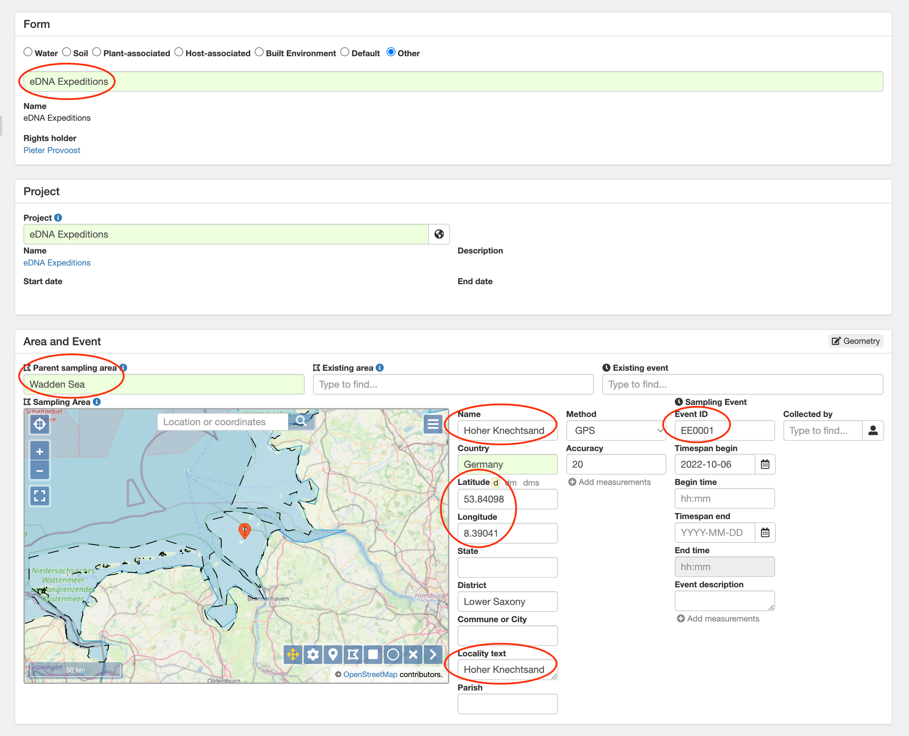
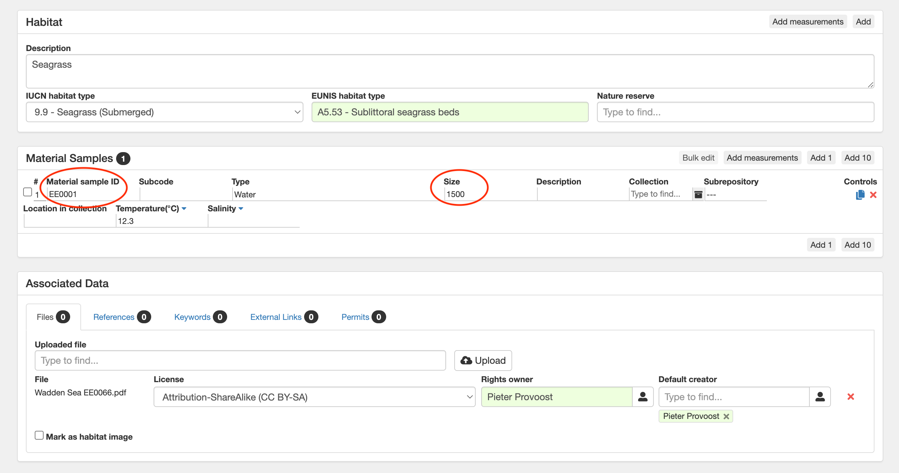
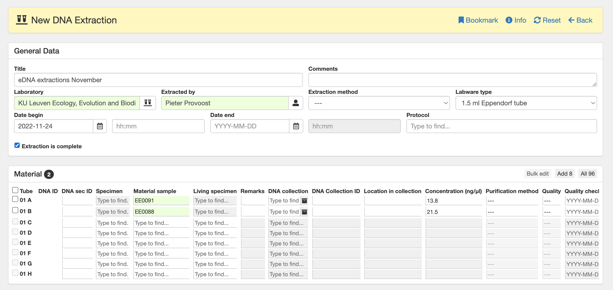

# edna-data-entry

This is the documentation for data entry in the UNESCO eDNA Expeditions project. Sample metadata in this project are collected using a mobile app as well as physical sampling sheets. Metadata are then entered into [PlutoF](https://plutof.ut.ee/).

## Sampling sites

The participating marine World Heritage sites are entered into PlutoF as top level sampling areas. To create a new sampling area, go to the eDNA Expeditions project page and click New in the Sampling Areas panel. Enter the appropriate site name, and add a site polygon by clicking the Geometry button in the General Data panel.

## Material samples

eDNA samples can be entered into PlutoF by going to the Related Records on the project page and selecting the Material Samples tab. Because each sample can be taken at a slightly different location, each material sample will have its own sampling event and (lower level) sampling area.

In the Material Sample form, first select the eDNA Expeditions form. The select the World Heritage site as the Parent sampling area. Do not select an existing event or an existing area. Enter the kit identifier as the Event ID. Enter the sampling coordinates and time. Use the locality information for the sampling event name as well as the Locality text.

If you have habitat information, add that in the Habitat panel.

Use the sample sample identifier as the Material sample ID. Enter the sample volume in Size, and enter eny environmental measurements. Upload the scanned sampling sheet under Files in the Associated Data panel.

## DNA extractions

The molecular lab will enter DNA extraction information including yield. Go to LABORATORIES > Molecular Lab > DNA Extraction. Create a new DNA Extraction.

Select the appropriate laboratory and the time of extraction. In the Material panel, enter one record for each material sample extracted. Enter the DNA concentration for each sample.

